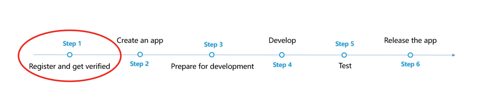
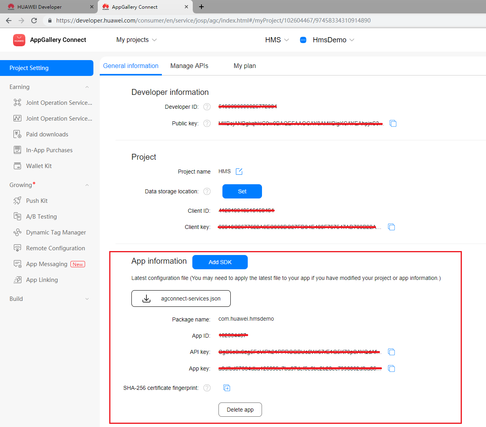
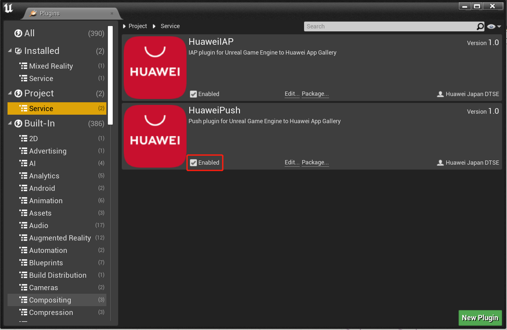
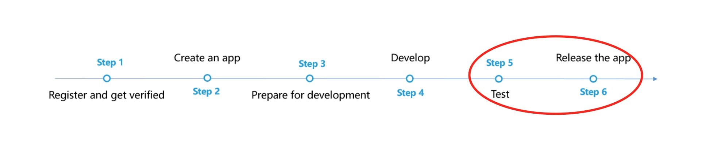
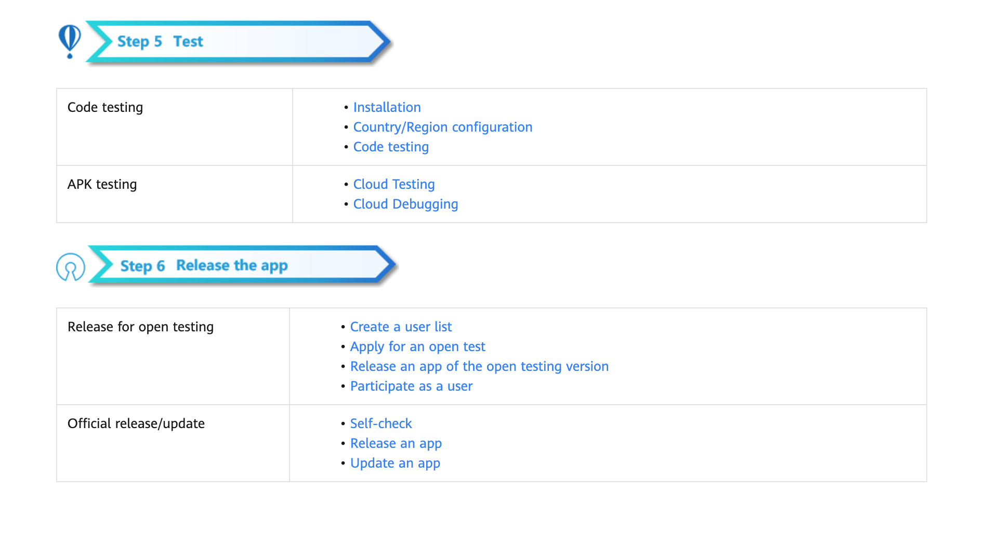

# Push Kit (HMS)

## Service Introduction

Push Kit is a messaging service provided for you to establish a cloud-to-device messaging channel. By integrating Push Kit, you can send messages to your apps on user devices in real time. This helps you maintain closer ties with users and increases user awareness of and engagement with your apps.

Push Kit consists of two parts:

1. Message push from the cloud to the device: enables you to send data and messages to your apps on user devices.

2. Message display on devices: provides various display styles, such as the notification panel, home screen banner, and lock screen on user devices.

You can click [here](https://developer.huawei.com/consumer/en/training/detail/101583005582480166) to watch the MOOC videos about Push Kit.

### Supported Devices

| <div style="width:80px">Device Type</div>                       | OS Version                | HMS Core（APK）Version                                                     |
  | ------------------------------------------------------------ | ----------------------- | ------------------------------------------------------------ |
  | Huawei phone and tablet | EMUI 3.0 or later                   | 3.0.0 or later |
  | Non-Huawei Android phones | Android 4.4 -12             | 3.0.0 or later                         |
  | Huawei phone and smart watch | HarmonyOS 2.0 or later                    | 5.0.0 or later |

### Service Features

- Notification message

    A notification message is directly sent by Push Kit and displayed in the notification panel on the user device, not requiring your app to be running in the background. The user can tap the notification message to trigger the corresponding action such as opening your app or opening a web page.

    You can tailor the display styles and reminder modes to fit user needs, which will greatly improve the daily active users (DAU) of your app.

    The common application scenarios of the notification message include subscription, travel reminder, and account status.
- Data message

    Data messages are processed by your app on user devices. After a device receives a message containing data or instructions from the cloud, the device passes the message to the app instead of directly displaying it. The app then parses the message and triggers the required action (for example, going to a web page or an app page). For such a message, you can also customize display styles for higher efficiency.

    Push Kit cannot guarantee a high data message delivery rate, because it may be affected by Android system restrictions and whether the app is running in the background.

    The common application scenarios of the data message include the VoIP call, voice broadcast, interaction with friends.

### Supported Countries/Regions
HUAWEI Push is now available in [these countries/regions](https://developer.huawei.com/consumer/en/doc/development/HMSCore-Guides/support-regions-0000001050047520).

### Privacy Statement
Before integrating Push into your app, you will need to sign the [HUAWEI Developers Service Agreement](https://developer.huawei.com/consumer/en/doc/start/agreement-0000001052728169) and [Agreement on Use of Huawei APIs](https://developer.huawei.com/consumer/en/doc/distribution/app/10129). You understand and accept that downloading or using the said kit will be deemed as you having agreed to all of the preceding agreements, and you will fulfill and assume the legal responsibilities and obligations in accordance with said agreements.

## Integrating into Your Unreal Project

### Register and get verified

Before you get started, you must register as a HUAWEI developer and complete identity verification on the [HUAWEI Developer website](https://developer.huawei.com/consumer/en). For details, please refer to [Register a HUAWEI ID](https://developer.huawei.com/consumer/en/doc/10104).



### Create an app
Create an app by referring to [Creating a Project](https://developer.huawei.com/consumer/en/doc/development/AppGallery-connect-Guides/agc-get-started#createproject) and [Creating an App in the Project](https://developer.huawei.com/consumer/en/doc/development/AppGallery-connect-Guides/agc-get-started#createapp). Set the following parameters as described:
- Platform: Select Android
- Device: Select Mobile phone
- App category: Select App or Game




Now you have your Huawei HMS Project and App information. Next, you need to enable Push service and configure the Push Parameters

1. Enabling Push
    
    To use Push, [enable this service](https://developer.huawei.com/consumer/en/doc/distribution/app/agc-help-enabling-service-0000001146598793#EN-US_TOPIC_0000001146598793__en-us_topic_0000001064950324_section135355454314) first.

2. Setting Push Parameters

    To use the HUAWEI in-app payment function, you need to [set Push Parameters](https://developer.huawei.com/consumer/en/doc/development/HMSCore-Guides/config-agc-0000001050033072).

### Prepare for development

According to [HMS integration process introduction](https://developer.huawei.com/consumer/en/codelab/HMSPreparation/index.html#6), we still need to add some configurations to the gradle files for development preparations.


1. Install the Plugin

   Copy and enable the Unreal Engine Plugin.

   If a `<unreal_project_directory>/Plugins` folder does not exist, create it.

   From the Huawei Push Unreal plugin, copy the HuaweiPush folder and its contents to `<unreal_project_directory>/Plugins`.
   

   From your Unreal Editor, select **Edit -> Plugins** menu then enable the Huawei Push Plugin.
   

2. Signing Certificate Fingerprint

   Please refer to Huawei [preparation documentation step 4](https://developer.huawei.com/consumer/en/codelab/HMSPreparation/index.html#3) for generating a SHA256 Certificate Fingerprint.

   

   And refer to Huawei [preparation documentation step 5](https://developer.huawei.com/consumer/en/codelab/HMSPreparation/index.html#4) to add Fingerprint to AppGallery Connect.

   

3. Package name

   Set the package name in **Edit -> Project Settings -> Android -> APK Packaging -> Android Package Name**

   The package name is `com.${Company Name}.${Product Name}`.

   You can also complete the rest of the settings here, such as version number, icons, resolution, etc. 

   

4. Set up plugin

   - Sign in to [AppGallery Connect](https://developer.huawei.com/consumer/en/service/josp/agc/index.html) and click **My projects**.
   - Find your app project and click the app that needs to integrate the HMS Core SDK.
   - Go to **Project settings > General information**. In the App information area, download the `agconnect-services.json` file.
   
   - You can put the json file under `<unreal_project_directory>/Configs/AGC` as default or in your own favorite path
   - In your Unreal Editor, select **Edit -> Project Settings -> Plugins -> HuaweiPush** then set up the `agconnect-services.json` file path.
   


## Developing with the SDK

### Developing

Access the Huawei Push API by including the header file `Push.h` in the related classes of your project.

```
#include "push.h"
```

Then set it with the `setListener` API

```
huawei::Push::setListener(new YourPushListener());
```

You can refer to Huawei documation for the [ProductInfo](https://developer.huawei.com/consumer/en/doc/development/HMSCore-References/productinfo-0000001050135784) and [InAppPurchaseData](https://developer.huawei.com/consumer/en/doc/development/HMSCore-References/inapppurchasedata-0000001050137635).


### Test & Release

Please refer to Huawei [integration procedure](https://developer.huawei.com/consumer/en/doc/start/htiHMSCore) for testing and releasing.



